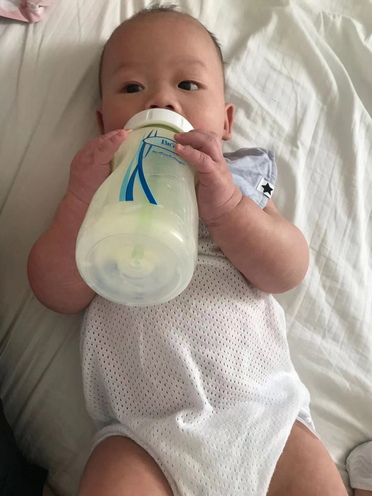

## Peifen Lu 18008550

 Taking care of a baby can be one of the most difficult things. First-time parents or even experienced parents can be nervous and sometimes have hard times dealing with baby stuff. For me, I find it helpful to record the feeding, poops, sleeps etc so that I know whether there is anything I need to worry about. To understand my baby's daily patterns, I decide to do an analysis on it. Hopefully, this portfolio can also be helpful to other parents and people who want to have babies. This project presents a statistical analysis of my baby's daily life (including feeds, poops and sleeps) from 1st March to 30th April. I recorded 60 days of my baby's daily life. 
 
{width=350px}
 

 
The dataset used has 60 rows and 13 columns. Each row corresponds to one day record. Here are some explanation of the data columns:

column[1]: day (I recorded 60 days from 1st March to 30th April)

column[2]: type means type of formula

column[3]: ml means total ml of formula he took per day

column[4]: feeds means number of feeds per day

column[5]: poops means number of poops per day

column[6]: colour means colour of poop

column[7]: shape means shape of the poop

column[8]: sleep means total sleep hours 

column[9]: nightslee means sleeping hours at night (from 7 pm to 7 am)

column[10]: daysleep means sleeping hours in the daytime (from 7 am to 7 pm)

column[11]: naps: number of naps (including day and night)

column[12]: carer means the person who took care of my baby

column[13]: weather

```{r}
babydata <- (read.table("babydata.txt",header=TRUE))
babydata

```

### First Analysis-t.test
My baby was taking aptamil in March and I changed his formula to neocate in April. 
The first analysis I do is to find out whether he is in favour of any type of formula.

The subset data below is the ml he took when he was taking aptamil and ml he took when he was taking neocate. 

```{r}
formula_aptamil <- babydata[1:30,3]
formula_aptamil
formula_neocate <- babydata[31:60,3]
formula_neocate
```

Null hypothese: There is no difference in ml before and after changing formula
```{r}
t.test(formula_aptamil,formula_neocate)
```

p-value is less than 5%. So there is strong evidence that there is a difference in total ml taken by my baby in these two formula.


### Second Analysis-Fisher's Exact Test
Second analysis: I will classfy my baby's poop into yellow, green, and normal or watery. I want to know whether there is a colour differnce in shape.

Here is the data:

```{r}
head(babydata)
contingency <- table(babydata[,"colour"],babydata[,"shape"])
contingency

```
Deleting the records where there is no poop for the day
```{r}
M <- matrix(c(3,18,7,26),2,2)

dimnames(M) <- list(colour=c("yellow","green"),shape=c("normal","watery"))
M
```
As I am not sure whether yellow poop will have more normal shape or watery shape, this is a two-sided test.

Null Hypothesis: Shape is independent of colour.

```{r}
fisher.test(M)
```
pvalue is greater 5%. So there is insufficient evidence to reject the null and it is reasonable to suppose that shape is independent of colour.


### Third Analysis-Fisher's Exact Test
Third analysis: I am interested in knowing whether number of poops differ by the amount of ml my baby takes.

```{r}
a <- sum(as.numeric(babydata[,"ml"])>=900 & as.numeric(babydata[,"poops"])>=2)
b <- sum(as.numeric(babydata[,"ml"])<900 & as.numeric(babydata[,"poops"])>=2)
c <- sum(as.numeric(babydata[,"ml"])>=900 & as.numeric(babydata[,"poops"])<2)
d <- sum(as.numeric(babydata[,"ml"])<900 & as.numeric(babydata[,"poops"])<2)
M <- matrix(c(a,b,c,d),2,2)
dimnames(M) <- list(ml=c(">=900","<900"),poops=c(">=2","<2"))
M
```
I might expect eating more is more likely to poop more. Therefore, it is a one-sided test.

Null Hypothesis: the amount of milk taken does not differ the number of poops

```{r}
fisher.test(M,alternative = "greater")
```

pvalue is greater than 5%. So there is insufficient evidence to reject the null and it is reasonable to suppose that the amount of milk taken does not differ the number of poops.


### Fourth Analysis-Fisher's Exact Test
I worry about the shape of poops differs by the type of formula taken. I decide to investigate whether it is or not by using another fisher.test. My hypothesis is that the shape of poops is independent of type of formula taken.

```{r}

contingency <- table(babydata[,"type"],babydata[,"shape"])
contingency

```

Deleting the records where there is no poop for the day
```{r}
M <- matrix(c(14,7,13,20),2,2)

dimnames(M) <- list(formula=c("aptamil","neocate"),shape=c("normal","watery"))
M
```
This is a two-sided test.
```{r}
fisher.test(M)
```

pvalue is greater than 5%. So there is insufficient evidence to reject the null and it is reasonable to suppose that the type of formula does not differ the shape of poops.


### Fifth Analysis-Fisher's Exact Test
Next Analysis: I am interested in whether the weather will differ the amount of ml taken. I expect my baby is more likely to take more milk if the weather is nicer. I will use a fisher.test to perform the analysis.

```{r}
a <- sum(as.numeric(babydata[,"ml"])>=900 & babydata[,"weather"]=="fine")
b <- sum(as.numeric(babydata[,"ml"])<900 & babydata[,"weather"]=="fine")
c <- sum(as.numeric(babydata[,"ml"])>=900 & babydata[,"weather"]=="rainy")
d <- sum(as.numeric(babydata[,"ml"])<900 & babydata[,"weather"]=="rainy")

M <- matrix(c(a,b,c,d),2,2)
dimnames(M) <- list(ml=c(">=900","<900"),weather=c("fine","rainy"))
M
```
Null Hypothesis:  weather does not differ the amount of milk taken

```{r}
fisher.test(M,alternative = "greater")
```

pvalue is greater than 5%. So there is insufficient evidence to reject the null and it is reasonable to suppose that weather does not differ the amount of milk taken.


### Sixth Analysis-Pearson's chi-square Test
I am now test whether My husband and I are equally sharing the responsibility taking care of our baby. I will test it using chi-square:
```{r}
sum(babydata[,"carer"]=="me")
sum(babydata[,"carer"]=="husband")

```

```{r}
o <- c(me=29, husband=31)
o
```

The first step is to form a null hypothesis $H_0: $: Prob(me) = Prob(husband) = 1/2,
where Prob(me) is the probability of me taking care of our baby. Prob(husband) is the probability of my husband taking care of our baby. If the null is true, we would expect to observe that each of us spent 30 nights with our baby for the last 60 days.

```{r}
e <- c(me=30, husband=30)
e
```

The chi-square statistic B:
```{r}
B <- sum((o-e)^2/e)
B
```

After that, the p-value is:

```{r}
pchisq(B,df=2-1,lower.tail = FALSE)
```

The pvalue is greater than 5%, so we fail to reject the null and it is reasonable to suppose that each of us has the same probability of taking care of our baby.


### Seventh Analysis-Pearson's chi-square Test
The number of poops dropped per day seems to follow Poisson distribution. I would do a test on whether the number of poops is Poisson. My null hypothesis is that the number of poops in a day follows Poisson distribution. The alternative hypothesis is that it does not follow Poisson distribution.
```{r}
o <- table(as.numeric(babydata[,"poops"]))
o
```

Thus, we have 5 days with zero poops, 33 days with 1 poop, 18 days with 2 poops, 3 days with 3 poops and 1 day with 4 poops.
The mean number of poops is:
```{r}
mean(as.numeric(babydata[,"poops"]))
```
Thus, we can model the number of poops dropped per day as a Poisson distribution with lambda = 1.366667. I will classify day as having 0,1,2,>=3 poops.
The probabilities of 0-2 poops is
```{r}
dpois(0:2,lambda = mean(as.numeric(babydata[,"poops"])))
```
The probability of having 3 or more will be
```{r}
1-sum(dpois(0:2,lambda = mean(as.numeric(babydata[,"poops"]))))
```
Therefore, the probabilities of 0,1,2,>=3 poops is

```{r}
probs <- c(dpois(0:2,lambda = mean(as.numeric(babydata[,"poops"]))),
                 1-sum(dpois(0:2,lambda = mean(as.numeric(babydata[,"poops"])))))
probs
```
To verify:
```{r}
sum(probs)
```
The expected number of day with 0,1,2,>=3 poops is:
```{r}
e <- length(as.numeric(babydata[,"poops"]))*probs
e
```
The chi-square test is:
```{r}
o 

```
```{r}
o <- c("0"=5,"1"=33,"2"=18,">=3"=4)
o
```
```{r}
B <- sum((o-e)^2/e)
B
pchisq(B,df=4-2,lower.tail = FALSE)
```
pvalue is less than 5%. We can reject the null. There is strong evidence that the observations(number of poops) are not consistent with a Poisson distribution.


### Another Analysis-Linear Regression on sleeps

{width=300px}


As parents, it is very important to know their babies' routines and getting to know whether they are having a good sleeping routine. 
I found some healthlines mention that as the days go by, babies are more likely to have less amount of daytime sleep. I am interested in whether my baby's daytime sleep is dependent on the day.

My Null Hypothesis $H_0: $ My baby's daytime sleep is independent of the day

```{r}
day <- as.numeric(babydata[,"day"])

daysleep <- as.numeric(babydata[,"daysleep"])

plot(daysleep~day,xlab="day",ylab = "hours of daytime sleep")

abline(lm(daysleep~day))
```


Is the regression line significant?

```{r}
summary(lm(daysleep~day))
```
pvalue is greater than 5%, so we fail to reject the null. So, there is no strong evidence that my baby's daytime sleep hours are dependent on the day. 


I want to do another analysis on the nightsleep.
My Null Hypothesis $H_0: $ My baby's night sleep is independent of the day

```{r}
day <- as.numeric(babydata[,"day"])

nightsleep <- as.numeric(babydata[,"nightslee"])

plot(nightsleep~day,xlab="day",ylab = "hours of night sleep")

abline(lm(nightsleep~day))
```


Is the regression line significant?

```{r}
summary(lm(nightsleep~day))
```
pvalue is greater than 5%, so we fail to reject the null. So, there is no strong evidence that my baby's night time sleep hours are dependent on the day. 


I will do another linear regression on the total sleep hours of a function of day
My Null Hypothesis $H_0: $ My baby's total sleep is independent of the day

```{r}
day <- as.numeric(babydata[,"day"])

totalsleep <- as.numeric(babydata[,"sleep"])

plot(totalsleep~day,xlab="day",ylab = "hours of total sleep")

abline(lm(totalsleep~day))
```


Is the regression line significant?

```{r}
summary(lm(totalsleep~day))
```
pvalue is greater than 5%, so we fail to reject the null. The coefficients are not statistically significant. So, there is no strong evidence that there is a change in my baby's total sleep hours with day.


### Another Analysis-Linear Regression on feeds


{width=300px}


I would like to know whether my baby's total amount of milk increases as the day goes by. Because I changed his formula in day 31, I will only take day 1-30 for first analysis to rule out the cause of changing formula.

```{r}
ml_aptamil <- as.numeric(babydata[1:30,3])

day <- seq_along(ml_aptamil)

plot(ml_aptamil~day,xlab="day",ylab = "total amount of ml (Aptamil) taken")

abline(lm(ml_aptamil~day))
```


Is the regression line significant?

```{r}
summary(lm(ml_aptamil~day))
```
The two-sided pvalue is not significant. However, the one-sided value is. In this case, the one-sided test is appropriate because it is reasonable to assume that babies take more food as they grow bigger. Therefore, we can reject the null and conclude that there is evidence that the total amount of milk taken is dependent on the day.


```{r}
ml_neocate <- as.numeric(babydata[31:60,3])

day <- seq_along(ml_neocate)

plot(ml_neocate~day,xlab="day",ylab = "total amount of ml (Neocate) taken")

abline(lm(ml_neocate~day))
```


Is the regression line significant?

```{r}
summary(lm(ml_neocate~day))
```
pvalue is less than 5% which is significant. Therefore, we can reject the null and conclude that there is evidence that there is a positive change in the total amount of milk taken with time.


### Another Analysis-Logistic Regression on milk taken
I am seek to estimate the colour of poops as a function of the amount of milk taken. I am wondering whether the colour is dependent of the amount of milk taken. My null hypothesis is that the colour of poops is independent of the amount of milk taken per day (ml).


```{r}
colour <- babydata$colour

for(i in 1:60){
  if(colour[i]=="yellow"){
    colour[i] <- 1
  }else{
    colour[i] <- 0
  }
}
colour <- as.numeric(colour)

formula_ml <- babydata[1:60,3]

LO <- function(p)(log(p/(1-p)))
pr <- function(LO){exp(LO)/(1+exp(LO))}
summary(glm(colour~formula_ml,family = "binomial"))

```
```{r}
plot(colour~formula_ml)
points(formula_ml,pr(-3.592299+0.004885*formula_ml),type = "l")
```
The pvalue is 0.0552 which is greater than 5%. It is not significant.There is no evidence that colour of poops is dependent on the amount of milk taken per day (ml).
&nbsp;
&nbsp;


### Another Analysis
I would like to investigate whether the total amount of milk taken is Gaussian. My null hypothesis is that the total amount of milk taken (ml) is Gaussian.
I will use quantile methods to investigate.


```{r}
formula_ml <- babydata$ml
hist(formula_ml)
plot(ecdf(formula_ml))
```


As we can see from the histogram, the data seems to follow Gaussian distribution.
And then I conduct the Empirical Cumulative Distribution Function. I will perform qqnorm() to detect non-normality.

```{r}
plot(qqnorm(formula_ml),ylab = "Sample Quantiles", xlab = "Theoretical Quantiles")
abline(mean(formula_ml),sd(formula_ml))
```
As we can see from the diagram above, the data fall approximately on a straight line. It means that it is normally distributed. I will perform a Shapiro-Wilk test to detect whether the data is normally distributed as well.
```{r}
shapiro.test(formula_ml)

```

From the Shapiro.test above, the pvalue is 0.33 which is greater than 5%. We can not reject the null and can conclude that it is reasonably that the data-the total amount of milk taken is Gaussian distribution.
&nbsp;
&nbsp;


### Another Analysis
I would like to investigate whether there is any significant difference between the ml of milk taken while I am the carer and the ml of milk taken while my husband is the carer.

My null hypothesis: There is no difference between the two data sets, the total ml of milk taken while I am the carer and total ml of milk taken while my husband is the carer.

Let's investigate:


To get the total amount of ml taken while Jacob is taken care by me:
```{r}
carer_me_ml <- babydata[which(babydata$carer=='me'),]
carer_me_ml <- carer_me_ml$ml
carer_me_ml
```
To get the total amount of ml taken while Jacob is taken care by my husband:
```{r}
carer_husband_ml <- babydata[which(babydata$carer=='husband'),]
carer_husband_ml <- carer_husband_ml$ml
carer_husband_ml
```
```{r}
hist(carer_me_ml)
hist(carer_husband_ml)
```
To plot their empirical cumulative distribution function on the sam axes:
```{r}
plot(ecdf(carer_me_ml))
plot(ecdf(carer_husband_ml),add=TRUE,col='red')
legend("topleft",col=c("black","red"),legend=c("ml with me as carer","ml with husband as carer"),lty=1)
```
The two ECDFs show a difference. We will use Kolmogorov Smirnov test to figure out whether there is statistically significant. 


```{r}
ks.test(carer_me_ml,carer_husband_ml)
```

pvalue is 0.6576 which is greater than 5%. The difference is not statistically significant. We fail to reject the null and can conclude that the two data sets are drawn from same distribution.


The Student t-test is also conducted:

```{r}
t.test(carer_me_ml,carer_husband_ml)
```
pvalue from the t.test is 0.7099 which is greater than 5%. The difference in means are not statistically significant. We fail to reject the null and conclude that there is no statistically difference in the means between these two data sets. 


## Conclusions

The dataset of babydata were analysed using statistical methods and a number of results have been obtained. There is a statistical difference in the total of ml taken before and after changing formula by using t.test. Through fisher.test, we can reasonably conclude that the shape of my baby's poop's is independent of the colour. The number of poops does not differ by the amount of ml taken. The weather does not differ the amount of ml taken. And it is reasonable to suppose that me and my husband shares the same probability of taking care of our baby by performing Pearson's chi-square test. We can also conclude that the number of poops my baby has per day is not consistent with Poisson distribution through Pearson chi-square test. By using linear regression, there is no evidence to suggest that the day does not have a statistically significant effect on my baby's daytime, nighttime sleep, and total sleep. There is strong evidence that there is a positive change in the total amount of milk (aptamil) taken and the total amount of milk (neocate) taken with day. The total amount of milk taken (ml) follows Gaussian distribution (Shapiro-Wilk test). By conducting the Kolmogorov-Smirnov test, we can find that there is not significant difference between the ml of milk taken while I am the carer and the ml of milk taken while my husband is. The Student t-test is also used to find out that the difference in means between the ml of milk taken while I being the carer and the ml of milk taken while my husband being the carer. The result shows the difference is not statistically significant.